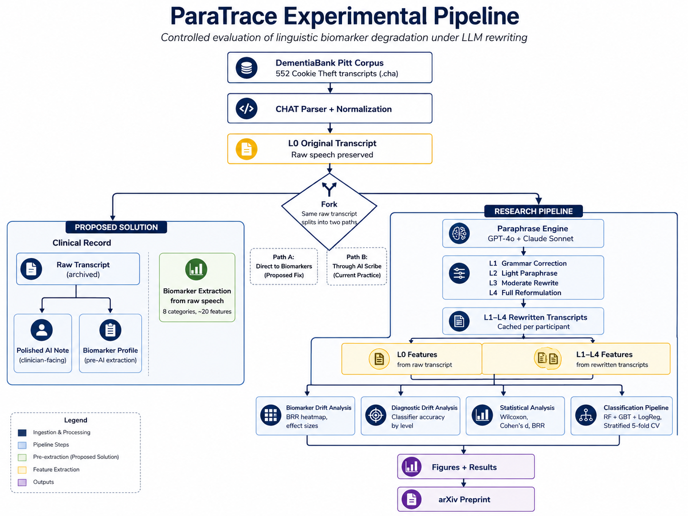
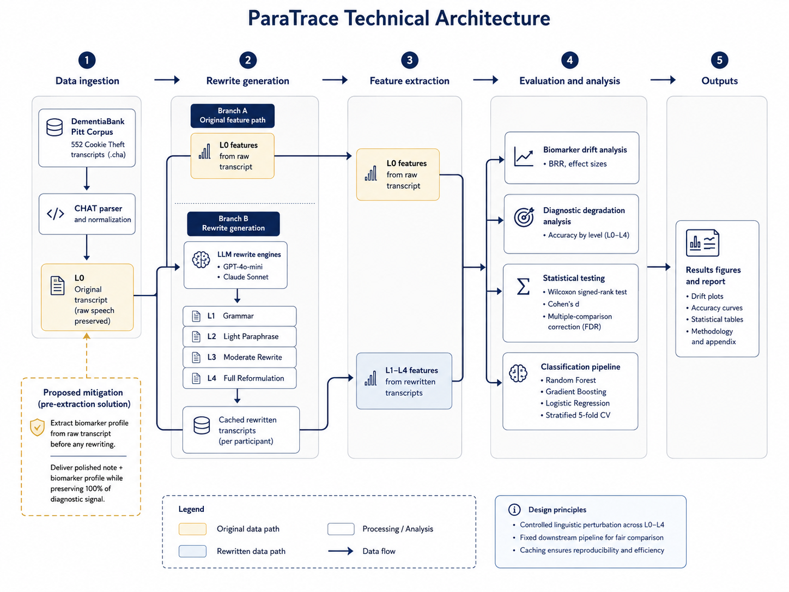
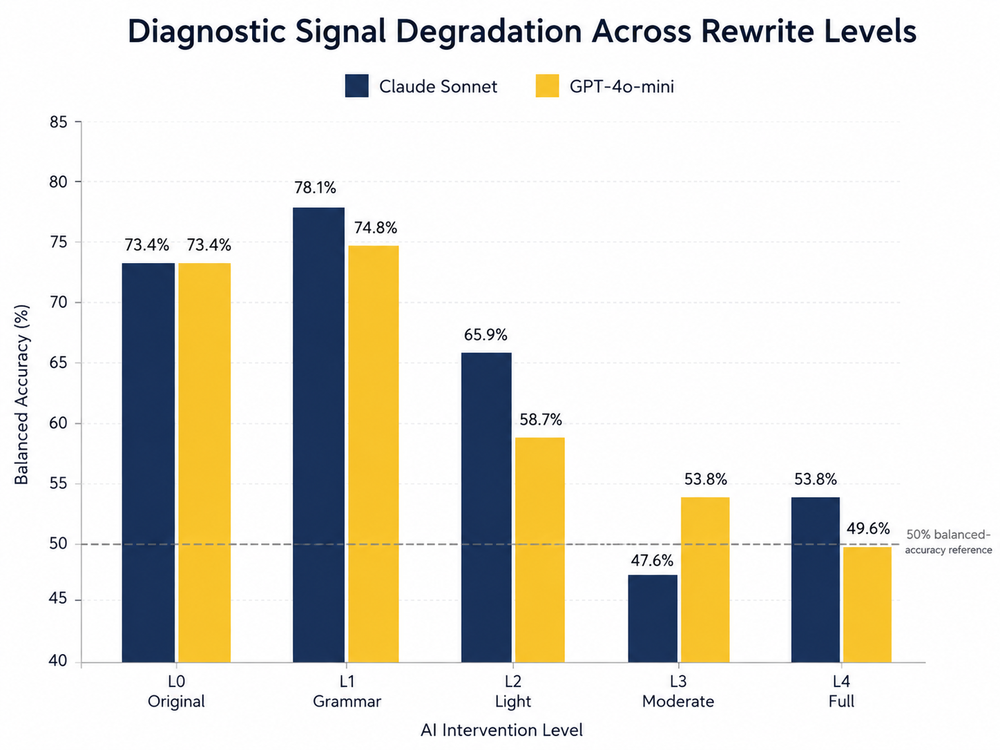
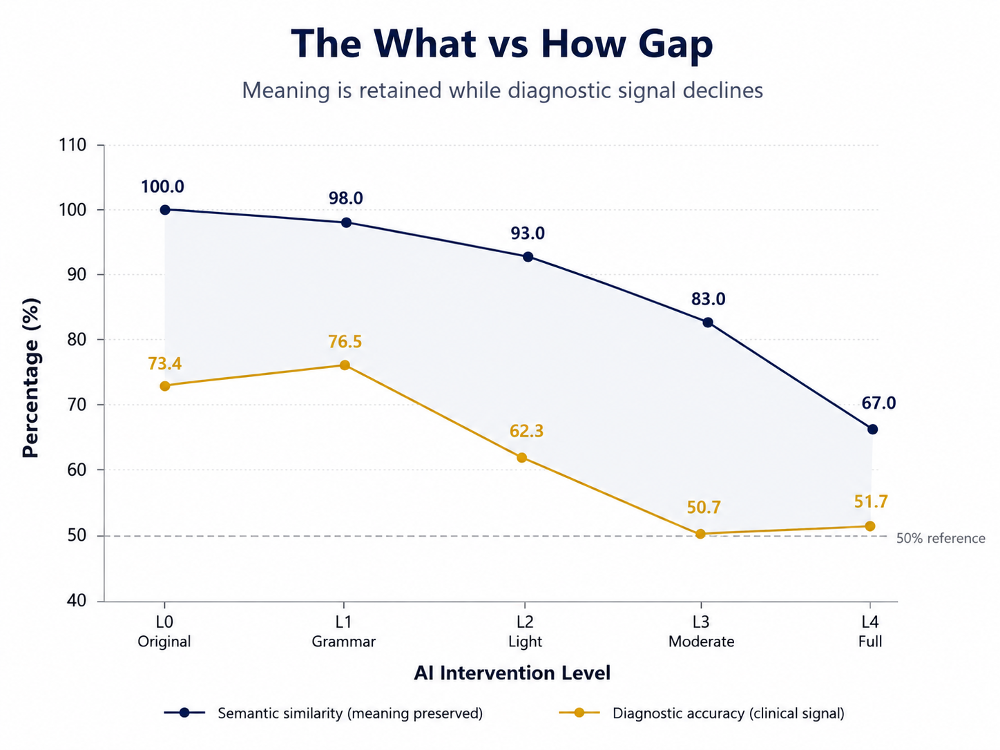
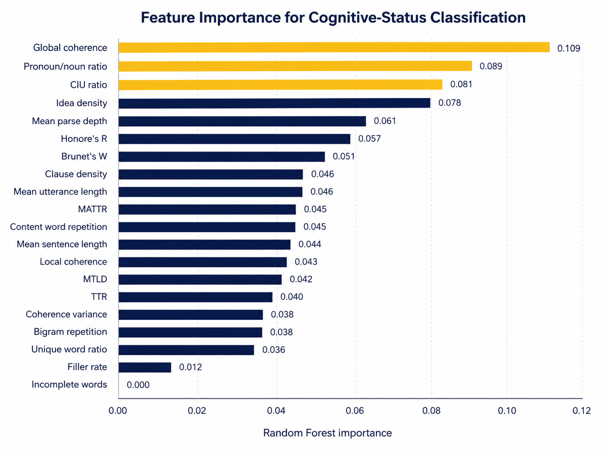
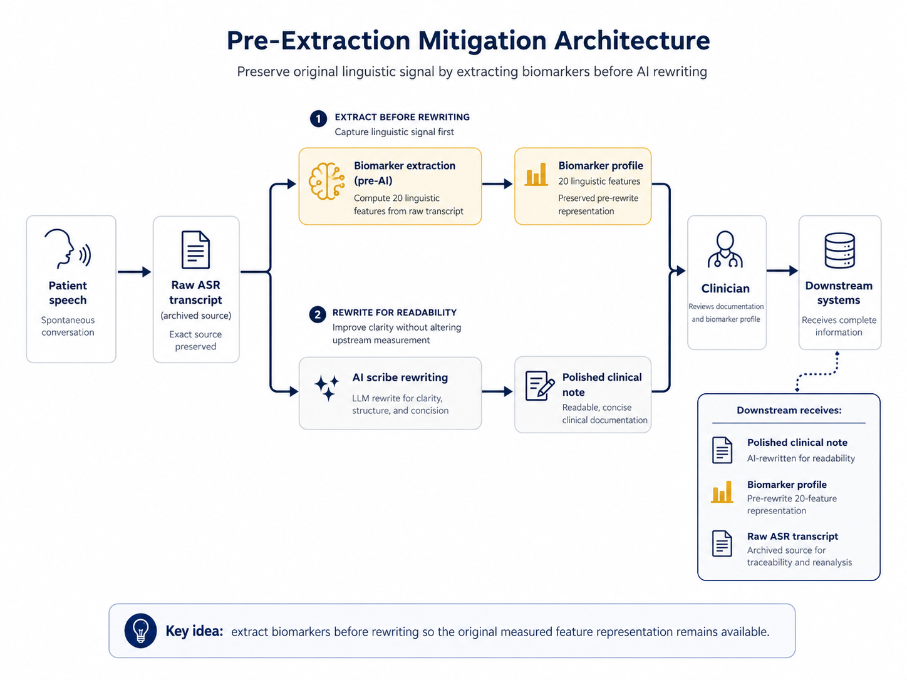
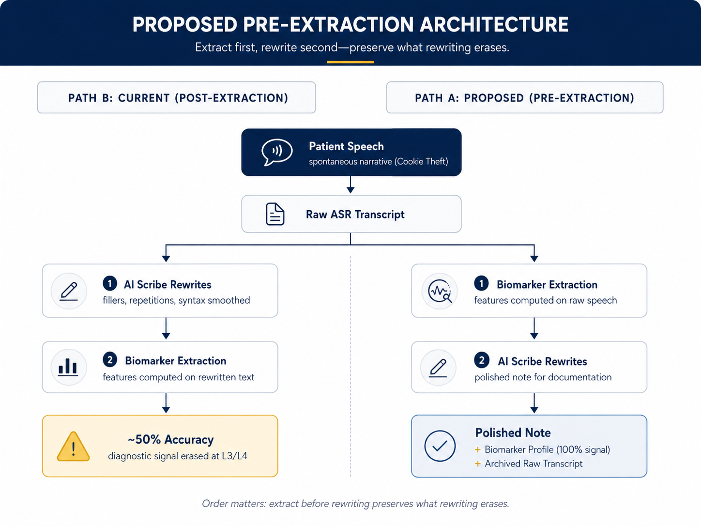

<div align="center">

# ParaTrace

### Measuring Linguistic Biomarker Degradation Under LLM Rewriting of Clinical Speech

**A controlled computational study evaluating whether language-model rewriting preserves linguistic features used in cognitive-status classification.**


</div>

---

## 01. The Problem

Ontario's [AI Scribe Program](https://www.supplyontario.ca/vor/software/tender-20123-artificial-intelligent-solutions-ai-scribe/) has pre-qualified 20+ vendors through Supply Ontario's VOR arrangement, with The Ottawa Hospital already deploying [Microsoft Dragon Copilot](https://www.ottawahospital.on.ca/en/patients-and-visitors/your-privacy-and-data/microsoft-dragon-copilot) to transform spontaneous patient speech into polished clinical documentation.

At the same time, a growing body of research demonstrates that computational speech analysis can detect early cognitive decline using the linguistic structure of spontaneous speech.

These two developments create a potential conflict. AI scribes are designed to normalize speech patterns such as fillers, repetitions, syntactic hesitations, and reduced coherence, while computational cognitive classifiers may rely on those same characteristics as predictive signals.

Prior work has already shown that removing verbal disfluencies alone can reduce automated dementia-detection accuracy by up to **5.6 percentage points** (Farzana et al., 2022).

> **A language model rewrite can preserve *what* a patient says while systematically erasing *how* they say it.**

If downstream diagnostic or analytical systems evaluate rewritten notes rather than the original speech representation, semantic fidelity alone may not be sufficient to retain predictive signal.

ParaTrace extends prior disfluency-removal findings to contemporary LLM-mediated rewriting by measuring whether progressively stronger, semantically preserving transformations alter a broader cognitive-linguistic feature representation and its downstream predictive utility.

---

## 02. Research Question

> **When LLMs rewrite clinical speech transcripts across progressive intervention levels, which cognitive-linguistic biomarkers are preserved, which are altered, and how severely does this alteration degrade downstream cognitive-status classification?**

---

## 03. Pre-Specified Hypotheses

The protocol, experimental variables, evaluation procedures, and statistical tests were frozen on **August 18, 2026**, prior to final model evaluation. The complete frozen protocol is available in [`docs/protocol.md`](docs/protocol.md).

- **H1: Progressive biomarker degradation:** Increasing rewrite intensity produces progressively larger deviations from baseline L0 feature representations.

- **H2: Semantic preservation with signal loss:** Semantic embeddings maintain high similarity across rewrites while structural and syntactic biomarkers undergo significant degradation.

- **H3: Downstream classifier degradation:** Classifiers trained on baseline L0 distributions lose predictive performance when evaluated on rewritten L1 to L4 feature spaces.

- **H4: Differential biomarker vulnerability:** Fluency, repetition, and word-finding markers degrade at lower intervention thresholds, L1 to L2, than global discourse coherence markers, L3 to L4.

- **H5: Cross-backend consistency:** Similar biomarker degradation patterns emerge across the evaluated LLM providers.

---

## 04. Experimental Design



**552** clinically labeled transcripts from the [DementiaBank Pitt Corpus](https://dementia.talkbank.org/), consisting of **243 Control** and **309 Dementia** transcripts, were processed through two LLM backends, GPT-4o-mini and Claude 3.5 Sonnet, at four progressive intervention levels.

The resulting experiment contains **4,416 total rewrites**. Twenty linguistic biomarkers spanning eight clinically grounded categories were extracted using spaCy, Sentence Transformers, and lexicalrichness.

All hypotheses, variables, and statistical tests were **pre-specified and frozen before final analysis**. The complete protocol is available in [`docs/protocol.md`](docs/protocol.md).

### System Architecture



---

## 05. What We Found

### 1. Diagnostic Signal Degradation



| Level  | Intervention | Description                             | Anthropic |   OpenAI  |  Average  |
| :----- | :----------- | :-------------------------------------- | :-------: | :-------: | :-------: |
| **L0** | Baseline     | Unaltered spontaneous transcript        | **73.4%** | **73.4%** | **73.4%** |
| L1     | Grammar      | Punctuation and grammatical correction  |   68.8%   |   66.5%   |   67.7%   |
| L2     | Paraphrase   | Filler removal and structural smoothing |   62.3%   |   56.9%   |   59.6%   |
| **L3** | **Moderate** | **Clinical note restructuring**         | **51.8%** | **52.5%** | **52.2%** |
| **L4** | **Full**     | **Complete prose reformulation**        | **54.2%** | **53.3%** | **53.8%** |

**Key findings**

* **Degradation begins at the lightest intervention level.** Grammar-only rewriting at L1 reduces average classification accuracy from **73.4% to 67.7%**.

* **Stronger rewriting drives performance toward chance.** Mean accuracy falls to **59.6% at L2**, **52.2% at L3**, and **53.8% at L4**.

* **The effect appears across both evaluated backends.** Anthropic falls from **73.4% to 54.2%** at L4, while OpenAI falls from **73.4% to 53.3%**.

* **Feature drift emerges before classifier collapse.** At L2, **19 of 20 features** are significantly altered for Anthropic and **20 of 20 features** for OpenAI under Wilcoxon signed-rank testing with Benjamini-Hochberg FDR correction.

All levels were evaluated using **stratified 5-fold cross-validation**, with identical fold assignments across L0 through L4 and no train-set leakage.

### 2. The "What vs. How" Gap



Even as downstream classification performance deteriorates, **semantic cosine similarity remains above 83%** across the evaluated rewrites.

This exposes the central information-preservation gap measured by ParaTrace:

> **The rewritten transcript can preserve what the patient says while progressively altering how it was originally expressed.**

Semantic fidelity therefore does not necessarily imply preservation of the linguistic representation used by a downstream cognitive classifier.

### 3. Feature Importance



The baseline classifier draws substantial predictive signal from features including **global coherence, pronoun-to-noun ratio, and CIU ratio**.

These results help explain why aggressive rewriting can reduce downstream performance: the LLM is not simply changing surface wording. It is shifting features that contribute directly to the classifier's original decision boundary.

---

## 06. Proposed Mitigation

ParaTrace proposes a **pre-extraction architecture** that separates preservation of the original linguistic signal from generation of the polished clinical note.

Instead of extracting downstream biomarkers from text after it has been rewritten, the proposed pipeline derives the linguistic representation from the original speech transcript first.



```text
Patient speech
      |
      v
Raw ASR transcript
      |
      +------> Pre-extraction ------> Preserved biomarker profile
      |
      v
LLM rewriting
      |
      v
Polished clinical note
```

Under this architecture, the two outputs serve different purposes:

* **Polished clinical note:** optimized for documentation readability and workflow efficiency.
* **Preserved biomarker profile:** derived before LLM normalization and retained for downstream analysis.

The design avoids requiring a rewritten clinical note to serve simultaneously as both a readable document and a faithful representation of spontaneous speech.

### Current vs. Proposed Pipeline



The proposed architecture remains a **mitigation hypothesis**, not a clinically validated deployment.

ParaTrace demonstrates that linguistic rewriting can degrade downstream predictive signal and shows computationally why pre-extraction would preserve the original L0 feature representation. Further validation would be required before claiming clinical effectiveness, operational safety, or improved diagnostic outcomes.

---

## Quickstart

Clone the repository and create a local environment:

```bash
git clone https://github.com/cybr-wisp/paratrace-cym2026.git
cd paratrace-cym2026
python -m venv venv
```

Activate the environment:

**Linux / macOS**

```bash
source venv/bin/activate
```

**Windows PowerShell**

```powershell
.\venv\Scripts\Activate.ps1
```

Install dependencies and the required spaCy model:

```bash
pip install -r requirements.txt
python -m spacy download en_core_web_sm
```

Create a local environment file:

```bash
cp .env.example .env
```

On Windows:

```powershell
Copy-Item .env.example .env
```

Add your OpenAI and Anthropic API credentials to `.env`.

> **Dataset access:** Running the full experiment requires authorized access to the DementiaBank Pitt Corpus. Raw participant transcripts are not included in this repository.

## Pipeline

The experiment is organized as a reproducible sequence from raw transcript ingestion to downstream degradation analysis.

| Stage                      | Script                                   | Purpose                                                                            |
| -------------------------- | ---------------------------------------- | ---------------------------------------------------------------------------------- |
| **1. Ingestion**           | `src/paratrace/ingestion/chat_parser.py` | Parse DementiaBank CHAT transcripts while preserving relevant linguistic structure |
| **2. Feature extraction**  | `src/paratrace/features/extractor.py`    | Extract 20 cognitive-linguistic biomarkers across 8 feature categories             |
| **3. LLM rewriting**       | `src/paratrace/rewriting/rewriting.py`   | Generate L1 to L4 rewrite conditions across both LLM backends                      |
| **4. Classification**      | `src/paratrace/modeling/classifier.py`   | Evaluate downstream classification, feature drift, and statistical significance    |
| **5. Mitigation analysis** | `src/paratrace/analysis/solution.py`     | Compare pre-extraction and post-rewrite representations                            |

Run the full experimental pipeline:

```bash
python src/paratrace/ingestion/chat_parser.py \
  --corpus-dir data/raw/cookie_only \
  --output data/processed/transcripts.csv

python src/paratrace/features/extractor.py \
  --input data/processed/transcripts.csv \
  --output data/processed/features_L0.csv

python src/paratrace/rewriting/rewriting.py \
  --input data/processed/transcripts.csv \
  --output-dir data/rewrites \
  --backend both

python src/paratrace/modeling/classifier.py \
  --mode all \
  --features data/processed/features_L0.csv \
  --features-dir data/processed/ \
  --output data/results/

python src/paratrace/analysis/solution.py \
  --features-dir data/processed/ \
  --output data/results/
```

---

## Engineering Highlights

- Built a reproducible evaluation pipeline over **552 clinically labeled transcripts**, generating **4,416 LLM rewrites** across **4 intervention levels** and **2 model providers**.

- Engineered a **20-feature NLP extraction pipeline across 8 linguistic categories**, covering lexical diversity, repetition, fluency, syntax, coherence, word finding, and information density.

- Evaluated **8 rewritten model conditions plus the L0 baseline** using identical preprocessing and **stratified 5-fold cross-validation** to prevent evaluation drift across experiments.

- Quantified a **21.2 percentage-point accuracy drop**, from **73.4% at baseline to 52.2% at L3**, with L4 remaining near chance at **53.8%**.

- Detected significant feature-distribution shift by L2: **19/20 biomarkers changed under Anthropic and 20/20 under OpenAI**, using paired Wilcoxon signed-rank tests with Benjamini-Hochberg FDR correction.

- Separated semantic fidelity from predictive fidelity: rewritten transcripts retained **>83% semantic cosine similarity** even as downstream classification approached chance performance.

- Implemented deterministic rewrite caching and reusable CLI workflows across **5 pipeline stages**: ingestion, feature extraction, LLM rewriting, classification/statistical analysis, and mitigation analysis.

- Persisted reproducible experiment outputs as **4 machine-readable result artifacts**, covering degradation metrics, statistical tests, biomarker-retention analysis, and sample biomarker profiles.

- Structured the project as a modular Python system with a **FastAPI backend, React frontend, Docker configuration, CLI tooling, and versioned experimental protocol**.

---

## Project Structure

```text
paratrace-cym2026/
│
├── api/
│   └── main.py
│
├── assets/
│   └── diagrams/
│       ├── diagnostic-degradation.png
│       ├── experimental-pipeline-architecture.png
│       ├── feature-importance.png
│       ├── pre-extraction-comparison.png
│       ├── pre-extraction-mitigation.png
│       ├── system-architecture.png
│       └── what-vs-how-gap.png
│
├── data/
│   ├── raw/
│   ├── processed/
│   ├── rewrites/
│   └── results/
│
├── docs/
│   ├── protocol.md
│   └── research_doc.md
│
├── frontend/
│   └── src/
│
├── src/
│   └── paratrace/
│       ├── analysis/
│       ├── features/
│       ├── ingestion/
│       ├── modeling/
│       └── rewriting/
│
├── .env.example
├── Dockerfile
├── Makefile
├── pyproject.toml
├── requirements.txt
└── README.md
```

## Data Availability

The DementiaBank Pitt Corpus is access-controlled to protect participant privacy. Raw participant transcripts are **not stored or distributed in this repository**.

Researchers wishing to reproduce the experiment must obtain authorized access directly through [DementiaBank](https://talkbank.org/dementia/access/English/Pitt.html) and comply with the corpus terms of use.

## Acknowledgements

This work was informed by consultations spanning health policy and patient advocacy. Extended policy context, consultation notes, and academic references are documented in [`docs/research_doc.md`](docs/research_doc.md).

* **Nicole Minutti**, Senior Health Policy Advisor at the Office of the Information and Privacy Commissioner of Ontario, provided context on the scope of Ontario's AI-scribe privacy guidance and helped clarify the distinction between privacy compliance, clinical appropriateness, and information fidelity.

* **Christine Aiken**, dementia advocate with Dementia Alliance International, contributed a lived-experience perspective emphasizing the importance of preserving authentic speech characteristics and patient voice when clinical information is transformed.

## Citation

If you use ParaTrace in research or derivative work:

```bibtex
@inproceedings{sindhu2026paratrace,
  title={ParaTrace: Measuring Linguistic Biomarker Degradation Under LLM Rewriting of Clinical Speech},
  author={Sindhu, Marie},
  booktitle={Connecting Young Minds 2026},
  year={2026},
  institution={University of Ottawa}
}
```

## License

[MIT](LICENSE)

---

<div align="center">

Built with ☕ by [Marie](https://github.com/cybr-wisp)

</div>