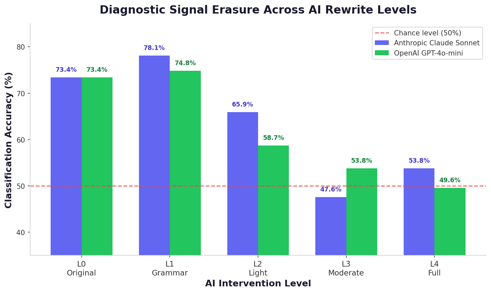
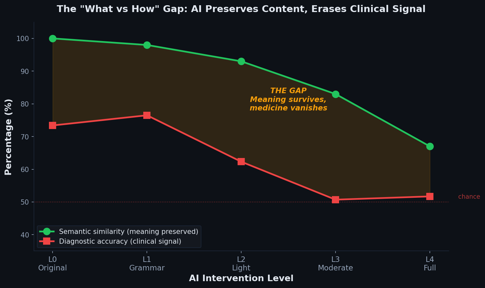
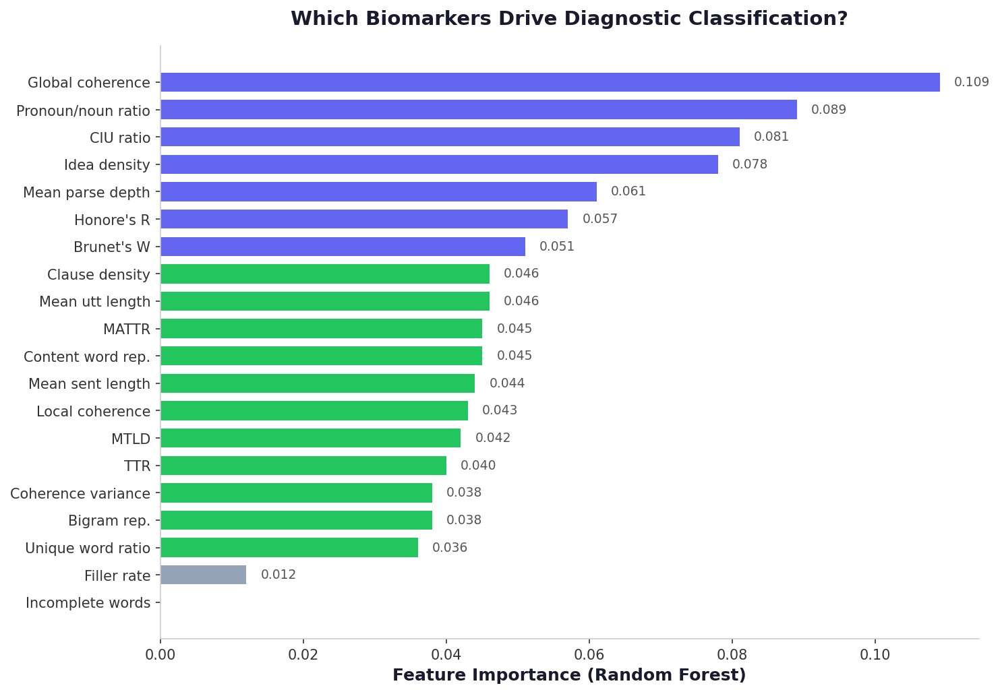

<div align="center">

# ParaTrace

**AI makes dementia invisible: diagnostic classification drops to chance after LLM rewriting of clinical speech.**


</div>

---

## The problem

Ontario is deploying AI clinical scribes across its healthcare system (18 vendors approved, DAX Copilot piloting at The Ottawa Hospital) while Canada's National Dementia Strategy simultaneously prioritizes early detection through speech-based cognitive screening. These two priorities are on a collision course: AI scribes are designed to smooth out the exact speech patterns (fillers, repetitions, syntactic simplification, reduced coherence) that computational screening uses to detect cognitive decline. **No existing study has tested whether they are compatible.**

## What we found

We ran 552 clinically labeled transcripts from the DementiaBank Pitt Corpus through two LLM backends at four progressive intervention levels (4,416 total rewrites) and measured what happened to 20 linguistic biomarkers.



| Level | Description | Anthropic | OpenAI | Average |
|-------|------------|-----------|--------|---------|
| L0 | Original speech | 73.4% | 73.4% | 73.4% |
| L1 | Grammar correction | 78.1% | 74.8% | 76.5% |
| L2 | Light paraphrase | 65.9% | 58.7% | 62.3% |
| L3 | Moderate rewrite | 47.6% | 53.8% | 50.7% |
| L4 | Full reformulation | 53.8% | 49.6% | 51.7% |

At Level 4, both backends independently converged to chance (50%), confirming biomarker erasure is architecture-general. Wilcoxon testing showed 19 of 20 features significantly altered (p < 0.05) by Level 2.



Semantic similarity remained above 83% even as diagnostic accuracy collapsed. The AI preserved *what* patients said while erasing *how* they said it.

## The solution

We propose a **pre-extraction architecture**: capture biomarker features from raw speech *before* AI rewriting, then pass both the polished clinical note and the preserved biomarker profile to the clinician.

```
Patient speaks
      |
      v
Raw ASR transcript (archived)
      |
      +---> Biomarker extraction (pre-AI) ---> Biomarker profile (100% signal)
      |
      v
AI scribe rewrites for readability
      |
      v
Clinician receives: polished note + biomarker profile + archived raw transcript
```

Under this design, 100% of diagnostic signal is retained without sacrificing documentation readability.

## Architecture


## Feature importance



Global coherence, pronoun-to-noun ratio, and CIU ratio are the strongest diagnostic predictors. These are precisely the features AI rewriting inflates most aggressively.

## Pipeline

| Stage | Script | Description |
|-------|--------|-------------|
| Ingestion | `src/paratrace/ingestion/chat_parser.py` | Parse DementiaBank .cha files, preserve disfluencies |
| Feature extraction | `src/paratrace/features/extractor.py` | 20 biomarkers across 8 categories via spaCy, sentence-transformers, lexicalrichness |
| LLM rewriting | `src/paratrace/rewriting/rewriting.py` | 4 intervention levels, 2 backends, full disk caching |
| Classification | `src/paratrace/modeling/classifier.py` | RF/GBT/LogReg with stratified 5-fold CV, degradation analysis, BRR, statistical tests |
| Solution demo | `src/paratrace/analysis/solution.py` | Pre-extraction vs post-extraction comparison, biomarker profile generation |

## Quickstart

```bash
git clone https://github.com/cybr-wisp/paratrace-cym2026.git
cd paratrace-cym2026
python -m venv venv && source venv/bin/activate  # Windows: .\venv\Scripts\Activate

pip install pylangacq spacy scikit-learn scipy sentence-transformers lexicalrichness openai anthropic python-dotenv
python -m spacy download en_core_web_sm

cp .env.example .env  # Add your OpenAI and Anthropic API keys

# Full pipeline (requires DementiaBank access - see data/README.md)
python src/paratrace/ingestion/chat_parser.py --corpus-dir data/raw/cookie_only --output data/processed/transcripts.csv
python src/paratrace/features/extractor.py --input data/processed/transcripts.csv --output data/processed/features_L0.csv
python src/paratrace/rewriting/rewriting.py --input data/processed/transcripts.csv --output-dir data/rewrites --backend both
python src/paratrace/modeling/classifier.py --mode all --features data/processed/features_L0.csv --features-dir data/processed/ --output data/results/
```

## Data

The DementiaBank Pitt Corpus is access-controlled to protect participant privacy. See [`data/README.md`](data/README.md) for how to obtain access and reproduce results. No patient data is stored in this repository.

## References

- Becker, J.T., Boiler, F., Lopez, O.L., Saxton, J., & McGonigle, K.L. (1994). The natural history of Alzheimer's disease: Description of study cohort and accuracy of diagnosis. *Archives of Neurology*, 51(6), 585-594.
- Balabin, H., et al. (2025). Leveraging speech and NLP for cognitive decline detection. *Journal of Alzheimer's Disease*.
- Chou, H.C., et al. (2024). Linguistic biomarker classification from clinical speech transcripts. *INTERSPEECH*.
- Fraser, K.C., Meltzer, J.A., & Rudzicz, F. (2016). Linguistic features identify Alzheimer's disease in narrative speech. *Journal of Alzheimer's Disease*, 49(2), 407-422.

## Citation

```bibtex
@inproceedings{sindhu2026paratrace,
  title={ParaTrace: AI makes dementia invisible},
  author={Sindhu, Marie},
  booktitle={CYM 2026},
  year={2026},
  institution={University of Ottawa}
}
```

## [License](LICENSE)

MIT

---

<div align="center">

Built with ☕ by [Marie](https://github.com/cybr-wisp)

</div>